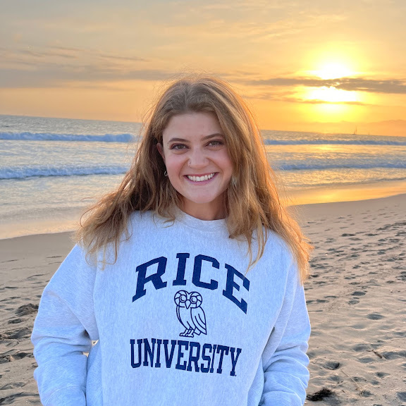
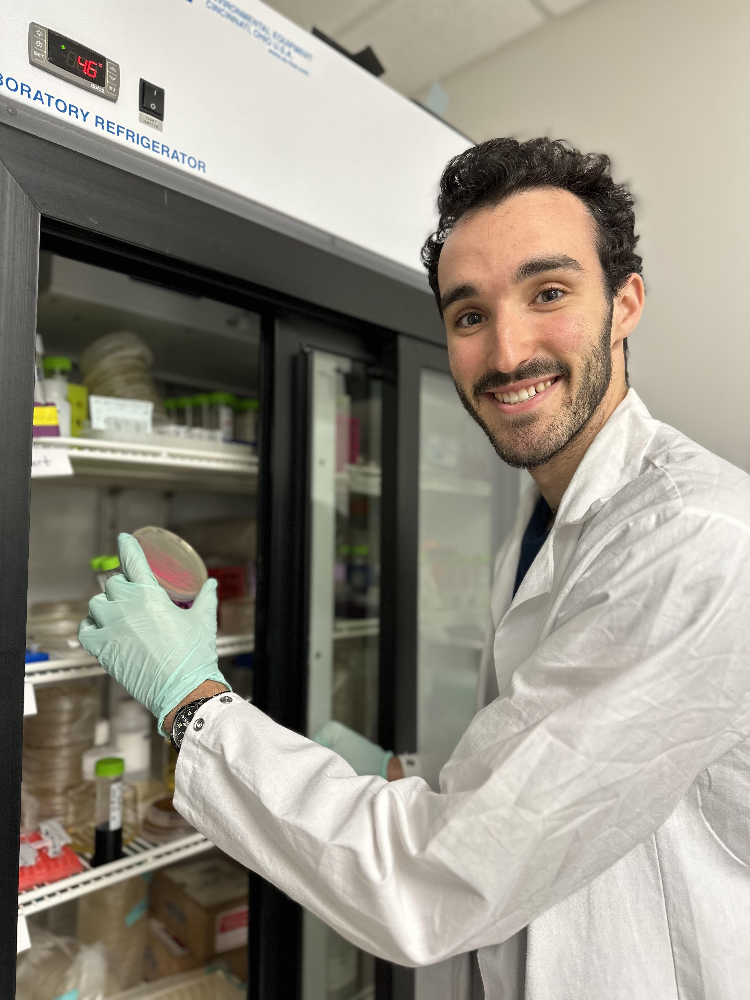

# BIOS 338/538 Syllabus: Analysis and Visualization of Biological Data, Spring 2024

## Course Description

This course addresses how to analyze, visualize and draw conclusions from biological data. It introduces basic concepts in statistics and the intuition behind them interwoven with training in data analysis using the `R` computing environment. Students will learn to identify underlying data structures and wrangle data. Students will also learn to effectively convey results using statistical graphics. Topics include basic `R` programming, data wrangling using modern [`tidyverse`](https://www.tidyverse.org/) packages, t-tests, statistical modeling (*linear regression, dose response curves)*. This class is targeted towards biologists, hence focuses on biological data for examples and omits rigorous statistical formulas. No prior experience with `R` required.

There will be a series of problem sets posted on the course website with instructions a week before they are due. You are encouraged to work with other students or use any outside resources when completing problem sets, but each student must submit their own written responses unless otherwise explicitly indicated in the problem set. Any group submissions or work should include attribution section detailing who did what. Students enrolled at the graduate level will produce a final project report detailing a specific biological research question, statistical methods and results and will present their final project to the class at the end of the semester.

## Course Logistics

**Instructor**: Dr. Prashant Kalvapalle (he/him), Lecturer + Postdoctoral researcher, Biosciences, Rice University

{width="200"}

**Location**: BRC 282 (*or via zoom with prior permission*)

**Time**: Tuesdays and Thursdays. 2:30-3:45 pm

**Email**: pbk1 \[at\] rice.edu

**Office**: Keck 205

**Office hours**: Friday, 3-4 pm, Keck 308 (*in person + zoom*)

*Note:* You will find the zoom links on the canvas website for the course

## TAS

### Annie Finneran

{width="200"}

PhD student in Ecology & Evolutionary Biology ([website](https://anniefinneran.weebly.com/))

**Email**: af58 \[at\] rice.edu.

**Office hours**: Tuesdays 11:30 am -- 12:30 pm, ABL 100 (*in person + zoom*)

### Sam Schwartz

{width="200"}

PhD student in Systems, Synthetic and Physical Biology ([website](https://www.linkedin.com/in/samuel-schwartz29/))

**Email**: Sam.Schwartz \[at\] rice.edu

**Office hours**: Mondays, 3 - 4 pm, Keck 308 (*in person + zoom*)

## Assessment

| Assignment      | Total grade | Details                                                                      |
|-----------------|-------------|------------------------------------------------------------------------------|
| Attendance      | 10%         | *on zoom with permission*                                                    |
| Participation   | 10%         | online discussion board (*ask/answer*), office hours, in-class participation |
| Problem sets    | 40%         |                                                                              |
| Midterm         | 20%         |                                                                              |
| Final / project | 20%         | For BIOS 538 : Final project presentation : `10%` and report `10%`           |

*Grading Scale*

-   A 93-100
-   A- 90-92
-   B+ 87-89
-   B 83-86
-   B- 80-82
-   C+ 77-79
-   C 73-76
-   C- 70-72
-   D 60-69
-   F \<60

### Assignment timelines

-   *Thursday*: Assignment uploaded and introduced in class

-   Get help in office hours during the week

-   ***Friday 7 pm***: submission

-   *Next Thursday*: Brief discussion on the previous week's assignment, common mistakes

-   *Next Saturday*: receive your grades and feedback from TAs

Again, if you need any accommodations for particular submissions please email the instructor.

### How challenging will it be if I am very new to `R`?

I believe that if you have one undergraduate level course where you **learnt** to code in **any programming language**, it should not be too challenging to pickup `R` syntax with 3 weeks of practice.

That said, the examples we walk through in class and working on the assignments (*with help from very enthusiastic TAs*) will be great resources to guide the learning process.

This classroom is a safe space, so no question is too simple or too "silly" to ask.

### There are many assignments, seems like a lot of work?

The lectures are structured to be interspersed with **5-10 min** coding sessions where we will walk everyone through stuff. You essentially save all the work we did in class, and add to that by working on your own time for the assignments.

So 25% of the assignment will already be done in class!

Practicing by working through code at your own time is the only way to actually learn coding.

## Textbooks/Reference material

There is no single textbook for the course. There will be multiple references, mostly from free textbooks or materials available online. All required readings and supplementary materials will be posted on the course website. All code and data files will also be posted on the course canvas site. Code and data files will typically be made available before class meetings; slides will be posted afterwards.

### Textbooks on general R / data science topics

-   [R manuals](https://rstudio.github.io/r-manuals/r-intro/): *Nice manual detailing lot of R usage in a nice website format*

-   [Fundamentals of data visualization](https://clauswilke.com/dataviz/index.html)

-   [R for Data Science](https://r4ds.hadley.nz/) : *nice guide to load, transform and visualize data*. From Hadley Wickham, one of the R/Tidyverse pioneers

-   [Advanced R](https://adv-r.hadley.nz/): (Hadley Wickham): *Improvement for R users/other language programmers. Functional programming, meta-programming, debugging, performance*

-   [Happy Git and GitHub for the useR](https://happygitwithr.com)

-   Other uses of R for graphics, reports, general automation in [R without Statistics](https://book.rwithoutstatistics.com/) *by David Keyes*

### Open textbooks on R and statistics

-   [Modern statistics with R](https://modernstatisticswithr.com/index.html)

-   Statistical Inference via Data Science : A ModernDive into R and the Tidyverse - [moderndive](https://moderndive.com/)

    \> *We have intentionally minimized the number of mathematical formulas used. Instead, you'll develop a conceptual understanding of statistics using data visualization and computer simulations. We hope this is a more intuitive experience than the way statistics has traditionally been taught in the past and how it is commonly perceived.*

-   Tidy Modeling with R -[Tmwr](https://www.tmwr.org/) : *how to use tidymodels packages ; develop good statistical practice*

-   [An introduction to data analysis](https://michael-franke.github.io/intro-data-analysis/Chap-01-00-intro-learning-goals.html): *R-data, plots; general logic of statistical inference, assess statistical analyses from literature*

-   Foundations in Statistical Reasoning (Kaslik) - [libretexts](https://stats.libretexts.org/Bookshelves/Introductory_Statistics/Foundations_in_Statistical_Reasoning_(Kaslik))

-   [Statistical Thinking for the 21st Century (Poldrack)](https://stats.libretexts.org/Bookshelves/Introductory_Statistics/Statistical_Thinking_for_the_21st_Century_(Poldrack)) : Libre text - Simulation, bayesian?

-   Introduction to Statistics with R : [Libre text](https://stats.libretexts.org/Courses/Cerritos_College/Introduction_to_Statistics_with_R) -- lot of basics, hypothesis testing?

### Open online courses

-   [Reproducible research in R](https://r-cubed-intro.rostools.org/): Beginner 3 day workshop. *R, version control, data wrangling, reproducible documents, visualization*
    -   Also has: [Intermediate](https://r-cubed-intermediate.rostools.org/): *focus on speed, functional programming, join data, pivots*;
    -   And [advanced](https://r-cubed-advanced.rostools.org/) modules: *collaboration, automatic analysis pipelines, publicizing via a website*
-   Allison horst's [Intro data analysis and stats](https://github.com/allisonhorst/esm-206-2018/) : Google slides and exercise material available
-   [Intro to R for biologists](https://expand.iu.edu/browse/rt/courses/r-for-biologists) : Check out syllabus, \_how to get course material?
-   Computational biology foundations - [syllabus](http://steipe.biochemistry.utoronto.ca/bio/CSB195-syllabus.html)
    -   Check out any courses from this nice faculty teaching R for 10 years, *interested in incorporating LLMs into teaching from this [question on posit](https://community.rstudio.com/t/copilot-or-similar-tool-integration-in-r-studio-plans/157412).* Faculty : [boris steipe](https://biochemistry.utoronto.ca/person/boris-steipe/)
-   [Rfun/duke](https://intro2r.library.duke.edu/outline.html): Topics covered
    -   Getting started: import data, data wrangling
    -   Data wrangling with dplyr
    -   Visualization with ggplot2
    -   Coding with ChatGPT
    -   Tidy data, pivot, join, and iteration (part 1)
    -   Functions & {purrr}; iteration part2
    -   Regression and tidymodels
-   Nice slides for basics of R - [tinystats/teacups-giraffes-and-statistics course/module 1](https://tinystats.github.io/teacups-giraffes-and-statistics/01_introToR.html)

------------------------------------------------------------------------

## Classroom policies

### Attendance

Since this course requires hands-on R use in class, and values participation, in-person attendance is highly encouraged. However, if you are unable to attend class in-person, please contact me in advance to avail the zoom option. There is no penalty for mussing upto 3 classes, additional absences will proportionally reduce the attendance part of the final grade.

Aside from excused absences, you are permitted to absences for *religious holidays* that are not included in the list of Federal and Academic holidays. Please let me know if you will be absent due to a religious holiday.

### Late submissions

You are automatically entitled to two late submissions throughout the course. Any additional late submissions have a penalty of 10% of the grade for that assignment. If you need any accommodations please email the instructor.

In addition, the policy for religious holidays under **Attendance** extends into late submissions - if you have a religious holiday that occurs on the day of or the day before an assignment is due, please let me know and I can provide an additional extension.

### Communication policy

You are welcome to email me at any time with your questions, concerns, and appointment requests. To ensure that I do not miss your email, please include *\[`course ID`\]-\[short summary of the query\]* in the email subject. For example, if you are requesting an additional appointment, the email subject should be: *\[course ID\]-scheduling appointment*.

### Names and pronouns

If you prefer a different name or gender pronoun than the one displayed on Canvas, please let me know. All students are expected to refer to each other by their correct names and pronouns during class. When addressing groups of people, use gender-neutral language. Here is a resource to assist you with inclusive, respectful language: [Pronouns](https://pronouns.org/).

### Etiquette.

In addition, no racist vocabulary will be permitted in class in *any* capacity. Please refer to each other with respect.

### Needs

If you face any challenges in securing personal or educational resources, such as a safe space and uninterrupted access to computing or the internet, and believe that these challenges may impact your performance in this class, please notify me. I will work with you to ensure that I can assist in any way possible.

### Inclement weather policy

In the event of extreme weather conditions that impact your ability to get to class in person, please inform me and I will announce opening the zoom to everyone for that day/class

### Academic honesty

#### Rice Honor Code

In this course, all students will be held to the standards of the *Rice Honor Code*, a code that you pledged to honor when you matriculated at this institution. If you are unfamiliar with the details of this code and how it is administered, you should consult the [Honor System Handbook](http://honor.rice.edu/honor-system-handbook/). This handbook outlines the University's expectations for the integrity of your academic work, the procedures for resolving alleged violations of those expectations, and the rights and responsibilities of students and faculty members throughout the process.

#### Attribution policy

Any collaborative work or help received should be duly acknowledge in the report under attributions section. For group submissions, please detail who did what for the assignment/report.

It is ideal to pre-determine how the work will be split by writing down the attribution section initially to prevent any confusion among the group.

### Accessibility

#### Disability resource center

If you have a documented disability or other condition that may affect academic performance you should: 1) make sure this documentation is on file with the Disability Resource Center (Allen Center, Room 111, adarice\@rice.edu, x5841) to determine the accommodations you need; and 2) talk with me to discuss your accommodation needs.

Furthermore, if you require course materials to be delivered in an alternate way to online .pdfs, please let me know.

## Attributions

This course was taught by Prof. Lydia Beadrout for 6 years and materials from the spring 2023 course were heavily relied upon to create the current course. Classroom policies for this page were verbatim borrowed from my wife, [Swetha Sridhar](https://cafgroup.rice.edu/home/people/swethasridhar/).
