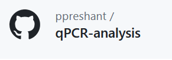
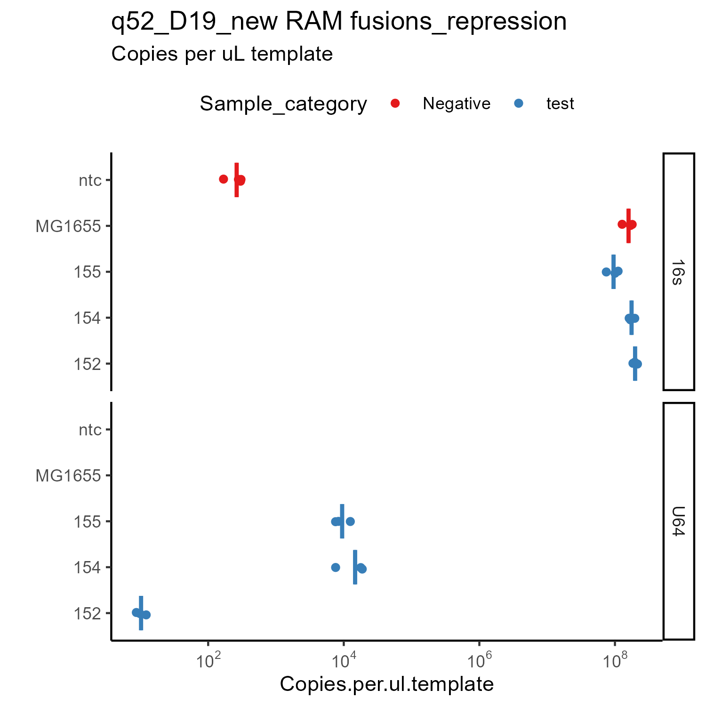
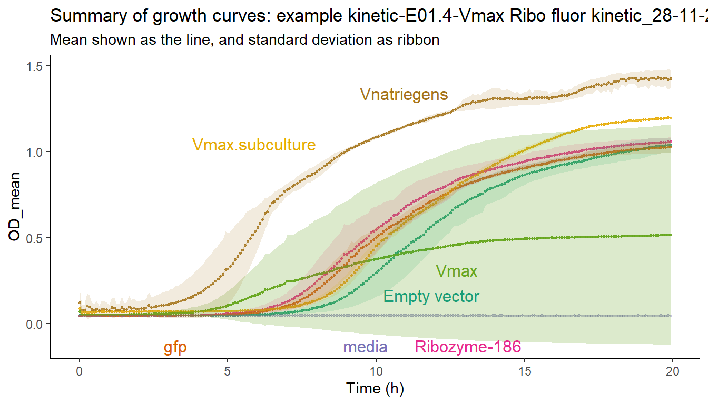
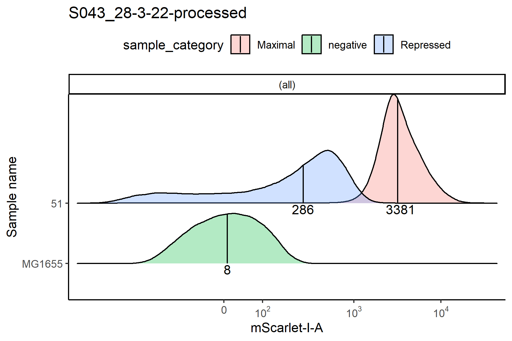
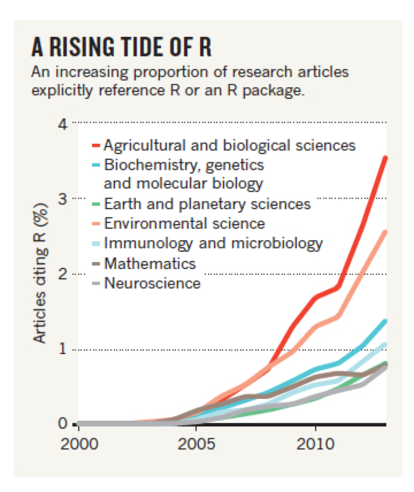

# A little bit about myself

--
- Grew up in India, finished undergrad in Biological Sciences & Bioengineering 
  - _knew some C programming back then_
--

- Did a Masters in Biomedical Engg. at Johns Hopkins
  - _I used Python here_
--

- Recently finished Ph.D. in Systems, Synthetic and Physical biology at Rice
  - _These days, I use R and other command line tools_
--


## How I got into R for data analysis?
- Trying to save effort by **automating** data analysis for **repeated experiments**
  - Ended up spending too much time coding in R
  - So I have to transfer my R skills before I leave Rice `r emo::ji('wink')`

---
# Was it useful to analyze my data in R?
Verdict : Yes, definitely!

.pull-left[

]

.pull-right[
- Ran **50 qPCRs** during Ph.D.
- Repetitive analysis required
  - Attach sample names
  - Calibrate: standard curve
  - Plot graph, label axes
  ]
--

.pull-left[

```{r demographs, echo=FALSE, out.width='50%'}


```
]

.pull-right[
- I have similar R pipelines for other datasets too
  - bacterial growth data : plate reader
  - Flow cytometry

```{r demograph2, echo=FALSE, out.width='50%'}

```

  
]


---
# Meet the wonderful TAs

.pull-left[
## Annie Finneran
PhD student in Ecology & Evolutionary Biology
[website](https://anniefinneran.weebly.com/)
Email: af58 [at] rice.edu.
Office hours: Tuesdays 11:30 am – 12:30 pm, ABL 105

]

.pull-right[
## Sam Schwartz
PhD student in Systems, Synthetic and Physical Biology
[website](https://www.linkedin.com/in/samuel-schwartz29/)
Email: Sam.Schwartz [at] rice.edu
Office hours: Mondays, 3 - 4 pm, Keck 305 conference room

]
--

## My office hours: 

Friday, 3-3:45 pm (in person), 3:45 - 4:30 pm (on zoom), Keck 305

--

## Discussion board
You can interact with the TAs, me and other classmates in this portal online -
[edsteam.org](https://edstem.org/us/courses/31344/discussion/)


---
# What can you expect to learn from this class? 

- To use R to load, process and analyze data statistically
  - Making nice plots with `ggplot()` and reproducible reports with `Rmarkdown` / `quarto`
- The intuition behind statistical tests _without going into rigorous mathematics_
- To critically evaluate statistics published in papers
  

---
# Detailed syllabus and resources

Here's the [course website](https://bios-538.github.io/) where you can find the detailed syllabus and lesson plan for every class: https://bios-538.github.io/#course-topics-schedule

_Please keep in mind that this syllabus is tentative and we will add or expand certain based on your feedback and how the class is doing_

## Summary of modules
- Intro, statistics refresher
- **R module**: getting started, data wrangling, plotting, ending with a in-class workshop
- **R advanced**: version control `git`, `Rmarkdown`, and using them with a workshop
- **Statistics module**: Normal distributions, t-tests, p-values and caveats, 
- **model fitting**: 2-dimensional data, linear and non-linear regressions
- higher dimensional data


---
# Textbooks

There is no standard textbook for this class, but there are quite a few open online textbooks that we will borrow material from.
_Note: most of the textbooks were written in `R`, using `Rmarkdown`

Here's a few good ones
- [Modern statistics with R](https://modernstatisticswithr.com/index.html)
- [Statistical Thinking for the 21st Century (Poldrack)](https://stats.libretexts.org/Bookshelves/Introductory_Statistics/Statistical_Thinking_for_the_21st_Century_(Poldrack)) : Libre text - Simulation, bayesian?
- [An introduction to data analysis](https://michael-franke.github.io/intro-data-analysis/Chap-01-00-intro-learning-goals.html)
- Statistical Inference via Data Science : A ModernDive into R and the Tidyverse - [moderndive](https://moderndive.com/)
 > 	We have intentionally minimized the number of mathematical formulas used. Instead, you’ll develop a conceptual understanding of statistics using data visualization and computer simulations. We hope this is a more intuitive experience than the way statistics has traditionally been taught in the past and how it is commonly perceived.
- Tidy Modeling with R -[Tmwr](https://www.tmwr.org/) : _how to use tidymodels packages ; develop good statistical practice_


---
# Grading 

| Assignment      | Total grade | Details                                                                      |
|-------------|-------------|----------------------------------------------|
| Attendance      | 10%         | *on zoom with permission*                                                    |
| Participation   | 10%         | online discussion boards (*ask/answer*), office hours, in-class participation |
| Problem sets    | 40%         |                                                                              |
| Midterm         | 20%         |                                                                              |
| Final / project | 20%         | For BIOS 538 : Final project presentation : `10%` and report `10%`           |


## Opportunities for extra credit
Upto 20% of the total grade of the class
- Asking a detailed question at [stackoverflow](https://stackoverflow.com/)
- Editing a Wikipedia article on topics related to the class/ statistics in general
- Helping your peers!

_We don't have a structure for these as of now, but please do write to us with a short summary of what you did for the extra credit and you shall get the credit_  

---
# Rice Honour Code

All students will be held to the standards of Rice's honour code for academic integrity.
These include not indulging in plagiarism, providing due credit to sources and acknowledging collaborators on assignments etc. 

--
## List the author contributions for all collaborations
- A good idea is to divide tasks first thing and write them down before starting action
  - Is a great tip for when beginning a collaborative research project as well
  - Minimizes skirmishes when publishing papers

???

Similar concept to pre-determining a statistical plan before beginning to collect data


---
#  Today’s Class 

- Introductory background on R and RStudio
- Software Installation
- Tour of RStudio
--

## Next class: 
Hands-on activity to understand histograms and basic t-test
- please come to class in-person to participate!


---
#  What is R? 

- Free, open source software software primarily used for statistical analysis by academics
--

- Composed of a “base” R system and other packages that can be installed for specific tasks

--
- Vibrant user community creates new tools. 
  - Lot of biologists have packages that could be useful to you!
--

.pull-left[
```{r rlogo, echo=FALSE, out.width='50%'}

```
]

.pull-right[
```{r rrise, echo=FALSE, out.width='70%'}

```

]

---
#  R is quite beginner friendly `r emo::ji('smile')`

**Key point**: You don’t have to be a great R programmer to use R effectively and do some amazing things, unlike many other programs

_I also mostly get by with a lot of internet search_ `emo::ji('wink')`
--

## Best way to learn R is by using it
- Practice by doing problem sets
- Pursuing hobby questions
- Analyzing your own data
  - Works great when there is no deadline ;)
--

#  Limitations 

Avoid R for any large data sets (_NGS sequencing type_) since R is quite memory hungry and likes to keep too much in the RAM

---
#  What is RStudio? 

```{r rstudiologo, out.width='50%'}
knitr::include_graphics('img/Rstudio_logo.png')
```

- Free, open source integrated development environment (IDE) for R
- ie.) Rstudio is the software we use to interact with R programs and their outputs such as data and plots
- Rstudio is run by [Posit.co](https://posit.co/), a [Bcorp](https://www.bcorporation.net/en-us/find-a-b-corp/company/rstudio/) committed to open-source movement
  - Posit employs quite a few developers who make excellent packages for R, including the amazing [tidyverse](https://www.tidyverse.org/) ecosystem of packages
<!-- - First public version in 2011 -->

---
class: center, middle

## Installing R and Rstudio
[Modern statistics with R](https://modernstatisticswithr.com/)

---
class: center, middle

## Touring around Rstudio
_if we have time.._

---
#  R Installation 

To Install R Open an internet browser and go to  www.r-project.org .
Click the "download R" link in the middle of the page under "Getting Started."
Select a CRAN location (a mirror site) and click the corresponding link.
Mac
Click on the "Download R for (Mac) OS X" link at the top of the page.
Click on the file containing the latest version of R under "Files."
Save the .pkg file, double-click it to open, and follow the installation instructions.
Windows
3. Click on the "Download R for Windows" link at the top of the page.
4. Click on the "install R for the first time" link at the top of the page.
5. Click "Download R for Windows" and save the executable file somewhere on
your computer. Run the .exe file and follow the installation instructions.
Now that R is installed, you need to download and install RStudio.
[To Install R Open an internet browser and go to](http://www.r-project.org/)
[www.r-project.org](http://www.r-project.org/)
[Click the "download R" link in the middle of the page under "Getting Started."](http://www.r-project.org/)
[Mac](http://www.r-project.org/)
[Click on the file containing the latest version of R under "Files."](http://www.r-project.org/)
[Windows](http://www.r-project.org/)
[         4. Click on the "install R for the first time" link at the top of the page.](http://www.r-project.org/)
[             your computer. Run the .exe file and follow the installation instructions.  ](http://www.r-project.org/)

---
#  RStudio Installation 

To Install RStudio:
Go to www.rstudio.com and click on the "Download RStudio" button.
Click on "Download RStudio Desktop."
**Mac users** : Click on the version recommended for your system, or the latest Mac version, save the .dmg file on your computer, double-click it to open, and then drag and drop it to your applications folder.
**Windows users** : Click on the version recommended for your system, or the latest Windows version, and save the executable file.  Run the .exe file and follow the installation instructions. 
[RStudio Installation](http://www.rstudio.com/)
[ and click on the "Download RStudio" button.](http://www.rstudio.com/)
[Windows users](http://www.rstudio.com/)

---
#  R Studio Tour 


---
# Summary: Today’s Class 

- Introductory background on R and RStudio
- Software Installation
- Tour of RStudio

## Next class: 
Hands-on activity to understand histograms and basic t-test
- please come to class in-person to participate!
