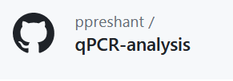
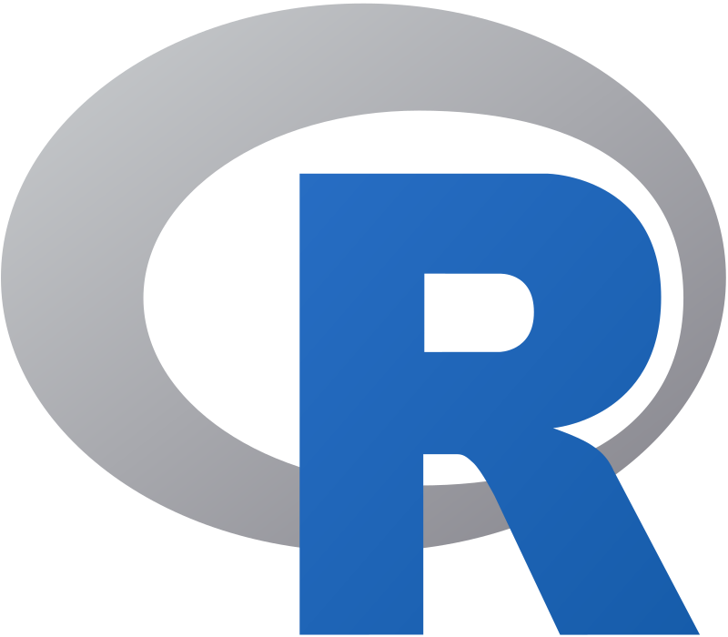
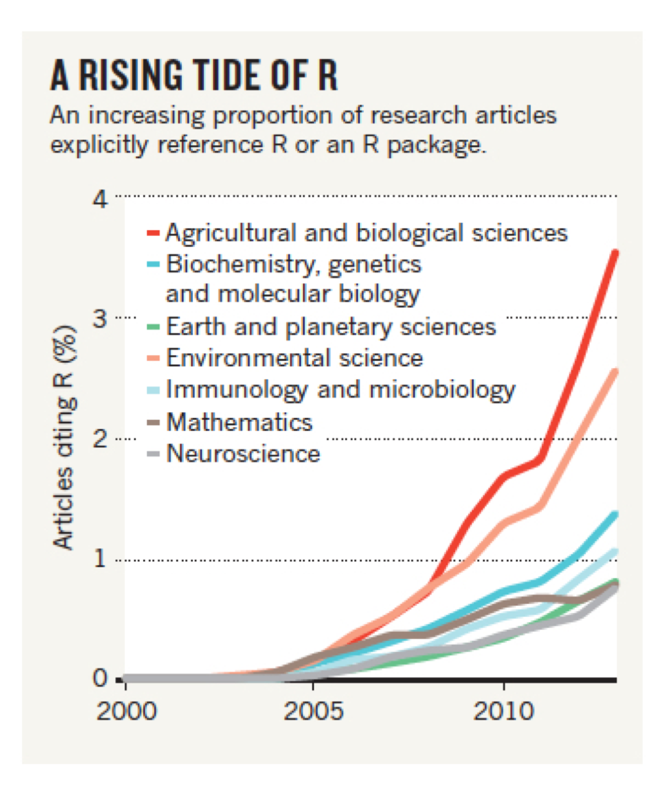
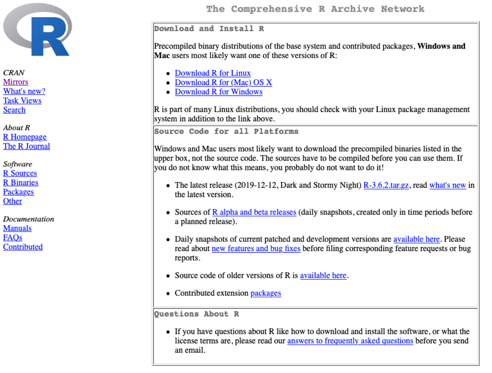

<!-- #  Tell me about yourself (on an index card)  -->

<!-- Preferred name (and pronouns if you like) -->
<!-- Year and major/degree program -->
<!-- Why you are you taking this class -->
<!-- What you hope to get out of this class -->
<!-- Interests after finishing school -->
<!-- Background in math, statistics, coding -->

<!-- --- -->
<!-- #  Now tell your group about yourself  -->

<!-- Name (and pronouns if you like) -->
<!-- Year and major/degree program -->
<!-- Why you are you taking this class -->
<!-- What you hope to get out of this class -->
<!-- Biggest concern about this class -->
<!-- Interests outside of academics -->

---
# A little bit about myself

--
- Grew up in India, finished undergrad there 
  - _knew some C programming back then_
--

- Did a Masters in Biomedical Engg. at Johns Hopkins
  - _I used python here_
--

- Recently finished Ph.D. in Systems, Synthetic and Physical biology at Rice
  - _These days, I use R and other command line tools_
--


## How I got into R for data analysis?
- Trying to save effort by **automating** data analysis for **repeated experiments**
  - Ended up spending too much time coding in R
  - So I have to transfer my R skills before I leave Rice `r emo::ji('wink')`

---
# Was it useful to analyze my data in R?
Verdict : Yes, definitely!

.pull-left[

]

.pull-right[
- Ran **50 qPCRs** during Ph.D.
- Repetitive analysis required
  - Attach sample names
  - Calibrate: standard curve
  - Plot graph, label axes
  ]
--

.pull-left[

```{r demographs, echo=FALSE, out.width='50%'}
knitr::include_graphics('img/qPCR_example.png')
knitr::include_graphics('img/growth_curve.png')
```
]

.pull-right[
- I have similar R pipelines for other datasets too
  - bacterial growth data : plate reader
  - Flow cytometry

```{r demograph2, echo=FALSE, out.width='50%'}
knitr::include_graphics('img/flowcyt_example.png')
```

  
]


---
# Meet the wonderful TAs

.pull-left[
## Annie Finneran


]

.pull-right[
## Sam Schwartz

]
--

## Office hours: 

TBD
--

## Discussion board
You can interact with the TAs, me and other classmates in this portal online -
[edsteam.org](https://edstem.org/us/courses/31344/discussion/)


---
# What can you expect to learn from this class? 

- To use R to Load, process and analyze data 
  - Making nice plots with `ggplot()` and reproducible reports with `Rmarkdown` / `quarto`
- The intuition behind statistical tests _without going into rigorous mathematics_
- To critically evaluate statistics published in papers
  

---
# Detailed syllabus and resources

Here's the course website where you can find the detailed syllabus and lesson plan for every class
- Put website

_Please keep in mind that this syllabus is tentative and we will add or remove sections based on your feedback and how the class is doing_

TODO : put a table with the syllabus here

---
# Textbooks?


---
# Grading 

TODO : put grading scheme here

## Opportunities for extra credit
- TODO : add stuff
- Editing a Wikipedia article

---
# Rice Honour Code

--
## List the author contributions for all team projects
- A good idea is to divide tasks first thing and write them down before starting action
  - Is a great tip for when beginning a collaborative research project as well
  - Minimizes skirmishes when publishing papers

???

Similar concept to pre-determining a statistical plan before beginning to collect data


---
#  Today’s Class 

- Introductory background on R and RStudio
- Software Installation
- Tour of RStudio

## Next class: 
Hands-on activity to understand histograms and basic t-test
- please come to class in-person to participate!


---
#  What is R? 

- Free, open source software
--

- Composed of a “base” R system and other packages for specific enhancements or tasks

--
- Vibrant user community creates new tools

--
.pull-left[]

.pull-right[]

---
#  R is quite beginner friendly `r emo::ji('smile')`

**Key point**: You don’t have to be a great R programmer to use R effectively and do some amazing things, unlike many other programs

.pull-left[]

.pull-right[]
--

## Best way to learn R is by using it
- Practice by doing problem sets
- Pursuing hobby questions
- Analyzing your own data
  - Works great when there is no deadline ;)


---
exclude: true

#  Limitations of R 

Avoid R for any large data sets (_NGS sequencing type_) since R is quite memory hungry and likes to keep too much in the RAM

- Requires learning new language
- Documentation of variable quality
- Packages of variable quality
- Inconsistencies among packages
- Memory hungry


---

The CRAN website houses many R packages



---
exclude: true

#  History of R 

R language first developed in 1991 as an open-source alternative to “S”, which was only available in “S-PLUS” commercial software
R Core Development Team formed in 1997
R version 1.0.0 release to public in 2000


---
#  What is RStudio? 


- Free, open source integrated development environment (IDE) for R
- ie.) Rstudio is the software we use to interact with R programs and their outputs such as data and plots
- Rstudio is run by [Posit.co](https://posit.co/), a [Bcorp](https://www.bcorporation.net/en-us/find-a-b-corp/company/rstudio/) committed to open-source movement
  - Posit employs quite a few developers who make excellent packages for R, including the amazing [tidyverse](https://www.tidyverse.org/) ecosystem of packages
<!-- - First public version in 2011 -->


---
#  R Installation 

To Install R Open an internet browser and go to  www.r-project.org .
Click the "download R" link in the middle of the page under "Getting Started."
Select a CRAN location (a mirror site) and click the corresponding link.
Mac
Click on the "Download R for (Mac) OS X" link at the top of the page.
Click on the file containing the latest version of R under "Files."
Save the .pkg file, double-click it to open, and follow the installation instructions.
Windows
3. Click on the "Download R for Windows" link at the top of the page.
4. Click on the "install R for the first time" link at the top of the page.
5. Click "Download R for Windows" and save the executable file somewhere on
your computer. Run the .exe file and follow the installation instructions.
Now that R is installed, you need to download and install RStudio.
[To Install R Open an internet browser and go to](http://www.r-project.org/)
[www.r-project.org](http://www.r-project.org/)
[Click the "download R" link in the middle of the page under "Getting Started."](http://www.r-project.org/)
[Mac](http://www.r-project.org/)
[Click on the file containing the latest version of R under "Files."](http://www.r-project.org/)
[Windows](http://www.r-project.org/)
[         4. Click on the "install R for the first time" link at the top of the page.](http://www.r-project.org/)
[             your computer. Run the .exe file and follow the installation instructions.  ](http://www.r-project.org/)

---
#  RStudio Installation 

To Install RStudio:
Go to www.rstudio.com and click on the "Download RStudio" button.
Click on "Download RStudio Desktop."
**Mac users** : Click on the version recommended for your system, or the latest Mac version, save the .dmg file on your computer, double-click it to open, and then drag and drop it to your applications folder.
**Windows users** : Click on the version recommended for your system, or the latest Windows version, and save the executable file.  Run the .exe file and follow the installation instructions. 
[RStudio Installation](http://www.rstudio.com/)
[ and click on the "Download RStudio" button.](http://www.rstudio.com/)
[Windows users](http://www.rstudio.com/)

---
#  R Studio Tour 


---
# Summary: Today’s Class 

- Introductory background on R and RStudio
- Software Installation
- Tour of RStudio

## Next class: 
Hands-on activity to understand histograms and basic t-test
- please come to class in-person to participate!
